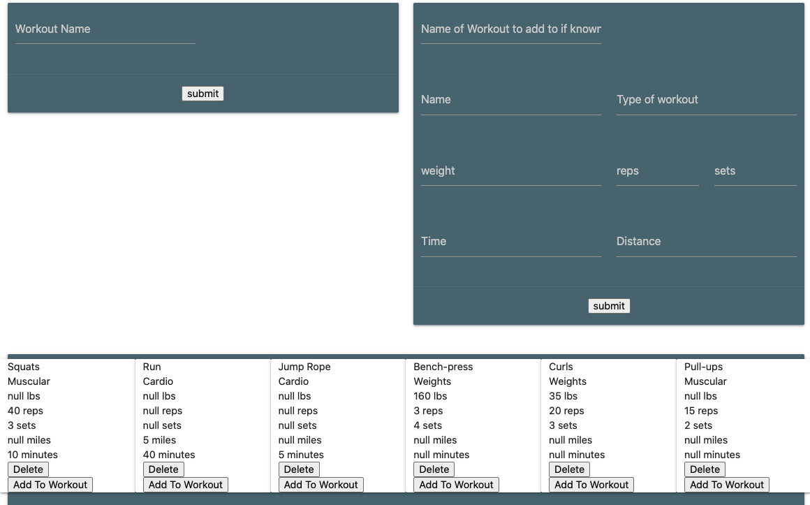
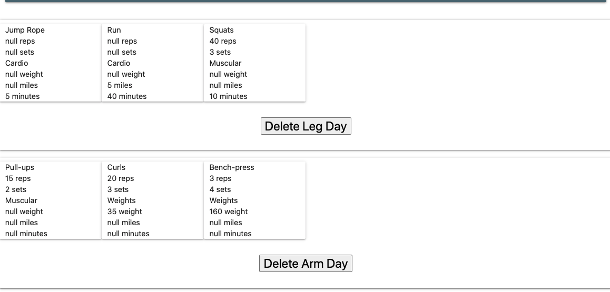

  # WorkOut Tracker

  

  ## Description

  A simple full stack application in which you can create workouts, create exercises, and add them to the workout of your choice. You may delete workouts or exercises. One thing to note, if you delete an exercise, it will be removed from any workouts it was added to.

 <a href="https://guarded-inlet-07649.herokuapp.com/">Deployed Link<a>

  ## Images

  
  

  
  ## Table of Content

  * [Installation](#installation)

  * [Usage](#usage)

  * [License](#license)

  * [Contributing](#contributors)

  * [Contact](#questions/contact)

  ## Installation

  To Install necessary dependencies, run the following command:
  
  npm install

  ## Usage

  It is an easy to use click driven program. To create a workout, enter the workout name into the input filed titled "Workout Name" and hit submit. You should be able to see your workout down below now. To create an exercise, simply use the input fields on the right of the display. If you wish to associate the exercise with a workout you may enter the workout name at the top but this is not necissary as you can add a exercise to a workout later if you choose. 
  
  ## Technologies

      HTML, CSS, JavaScrypt, Jquery and npm packages Express, compression, mongojs, mongoose, morgan.

  ## Contributors

  Ben Hopkins

  ## Questions/Contact

  <a href="https://github.com/bh007183">GitHub Profile</a>
  <a href="mailto:bjhops17@gmail.com"> Email Me</a>
  
  

  